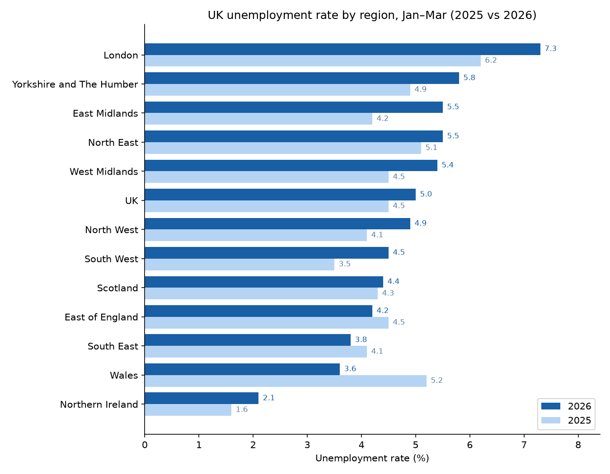
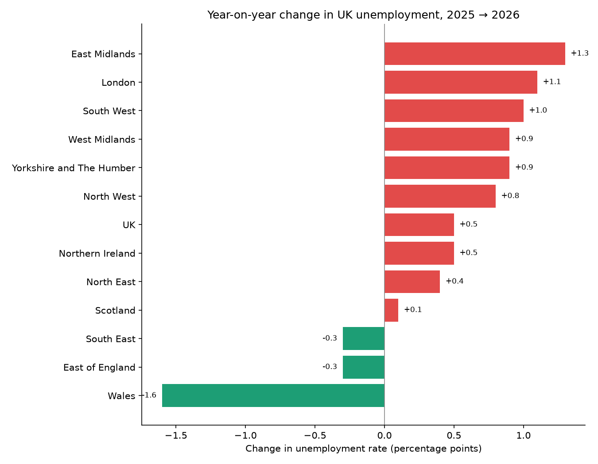

# UK Regional Unemployment: 2026 vs 2025 🇬🇧

My first SQL project — analysing how unemployment changed across the regions
and nations of the UK between 2025 and 2026, using real data from the
Office for National Statistics (ONS).

Built with **SQLite**.

## The question

Did unemployment rise or fall across the UK from 2025 to 2026, and which
regions changed the most?

## Data source

UK Office for National Statistics (ONS), Regional Labour Market bulletins —
unemployment rate, people aged 16+, for the January–March quarter (the latest
data available). Both years are taken directly from the published bulletins and
fact-checked against the source.

- `year = 2026` → Jan–Mar 2026 ([ONS bulletin, May 2026](https://www.ons.gov.uk/employmentandlabourmarket/peopleinwork/employmentandemployeetypes/bulletins/regionallabourmarket/may2026))
- `year = 2025` → Jan–Mar 2025 ([ONS bulletin, May 2025](https://www.ons.gov.uk/employmentandlabourmarket/peopleinwork/employmentandemployeetypes/bulletins/regionallabourmarket/may2025))

## How to build and run it

You need [SQLite](https://www.sqlite.org/) (pre-installed on macOS).

```bash
# 1. Create the database and the table
sqlite3 unemployment.db < schema.sql

# 2. Load the data
sqlite3 unemployment.db < data.sql

# 3. Run the analysis
sqlite3 -header -column unemployment.db < queries.sql

# 4. (Optional) Regenerate the charts
pip install -r requirements.txt
python3 make_charts.py
```

## Project structure

| File | What it does |
|------|--------------|
| `schema.sql`  | Defines the `unemployment` table (the blueprint) |
| `data.sql`    | Loads the 26 rows of real ONS figures |
| `queries.sql` | The analysis questions, written as SQL |
| `make_charts.py` | Reads the database and saves the charts as images |
| `requirements.txt` | Python packages needed for the charts |
| `charts/`     | The generated chart images |
| `README.md`   | This file |

## Key findings

Unemployment rose in most of the country. **9 of the 12 regions got worse**, the
UK-wide rate climbed from **4.5% to 5.0%**, and the average regional rate went
from **4.35% to 4.75%**.

| Region | 2025 | 2026 | Change |
|--------|-----:|-----:|-------:|
| East Midlands | 4.2 | 5.5 | **+1.3** |
| London | 6.2 | 7.3 | +1.1 |
| South West | 3.5 | 4.5 | +1.0 |
| Yorkshire & The Humber | 4.9 | 5.8 | +0.9 |
| West Midlands | 4.5 | 5.4 | +0.9 |
| North West | 4.1 | 4.9 | +0.8 |
| Northern Ireland | 1.6 | 2.1 | +0.5 |
| North East | 5.1 | 5.5 | +0.4 |
| Scotland | 4.3 | 4.4 | +0.1 |
| East of England | 4.5 | 4.2 | −0.3 |
| South East | 4.1 | 3.8 | −0.3 |
| Wales | 5.2 | 3.6 | **−1.6** |

- 📈 **East Midlands** had the sharpest rise (+1.3 points).
- 📉 **Wales** improved the most (−1.6 points); East of England and South East also edged down (−0.3 each).
- London remained the highest overall (7.3%); Northern Ireland the lowest (2.1%).

## Charts

Generated from the database by `make_charts.py` (so they always match the data).

**Unemployment rate by region, 2025 vs 2026:**



**Year-on-year change (who got worse, who improved):**



## What I learned

`CREATE TABLE` · `INSERT` · `SELECT` · `WHERE` · `ORDER BY` ·
`JOIN` (self-join) · aggregates (`AVG`, `MIN`, `MAX`, `COUNT`) · `GROUP BY` ·
plus reading a SQLite database from Python and charting it with matplotlib.
